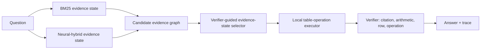

# Figure Plan for AAAI Submission

This document tracks the paper figures. The current figures are reproducibly
rendered from `scripts/render_paper_figures.py`; do not hand-edit the exported
PDF/PNG files.

Render command:

```powershell
python .\scripts\render_paper_figures.py
```

## Figure 1: Teaser / Pipeline Figure

Current artifact:

- `paper/figures/evigraph_pipeline.pdf`
- `paper/figures/evigraph_pipeline.png`
- Included in `paper/main.tex` as Figure~\ref{fig:method}.

Purpose:

- Show the end-to-end evidence-state control pipeline through a concrete
  TAT-QA failure-driven example.
- Make clear that retrieval outputs are candidates, not final context.
- Emphasize auditable intermediate artifacts: graph, support subgraph,
  operation trace, verifier result.

Recommended panels:

1. Query and heterogeneous retrievers:
   - BM25.
   - Neural dense.
   - Neural hybrid.
   - Optional source-rerank analysis setting, visually marked as analysis-only.
2. Candidate evidence graph:
   - Nodes: passages, table chunks, row candidates, calculation candidates.
   - Edges: source adjacency, table-row relation, temporal/year alignment,
     contradiction or noisy-source risk.
3. Evidence-state selector:
   - Utility/risk scoring.
   - Verifier-support flags.
   - Retrieval portfolio selector choosing between BM25 and neural-hybrid
     evidence states.
4. Local operation executor:
   - Row/column selection.
   - Sum, difference, ratio, percent change, average.
5. Verifier and output:
   - Citation check.
   - Arithmetic check.
   - Row grounding.
   - Operation semantics.
   - Final answer plus trace.

Visual emphasis:

- Use arrows from multiple retrievers into a shared candidate evidence graph.
- Put the selector/verifier in the center, not the retriever.
- Avoid making the figure look like "better retriever = solved".

## Figure 2: Mechanism Figure

Current artifact:

- `paper/figures/retrieval_portfolio_mechanism.pdf`
- `paper/figures/retrieval_portfolio_mechanism.png`
- Included in `paper/main.tex` as Figure~\ref{fig:retrieval-portfolio}.

Purpose:

- Explain the main empirical insight from the portfolio experiment.
- Neural hybrid improves source exposure, but final accuracy only improves when
  a no-gold confidence selector chooses the better evidence state.

Recommended panels:

1. BM25 evidence state:
   - Example fallback prose or wrong numeric operation.
   - Mark as "retrieved but not executable" or "supported but wrong operand".
2. Neural-hybrid evidence state:
   - Example complementary candidate with better query/year coverage or an
     executable calculation.
3. Verifier-guided confidence selector:
   - Inputs: fallback status, query-token coverage, year coverage, calculation
     presence, support flags.
   - Guard: two-year percent-change fallback must cover both query years.
4. Outcome:
   - v44 conservative: 0.388, 7 wins, 0 losses.
   - v45 confidence: 0.407, 19 wins, 1 loss.
   - v46 guarded confidence: 0.407, 18 wins, 0 losses.

## Figure 3: Experimental Story Panel

Current artifact:

- `paper/figures/experimental_story_panel.pdf`
- `paper/figures/experimental_story_panel.png`
- Included in `paper/main.tex` as Figure~\ref{fig:experimental-story}.

Purpose:

- Summarize the empirical story in one place, following the main-paper figure
  style used by recent RAG/GraphRAG papers: one panel states the mechanism, the
  remaining panels show where the evidence comes from.
- Panel A: FinQA-300 component gains for planner, support graph, and graph-vs-
  utility selection.
- Panel B: FinQA-600 retrieval portfolio result.
- Panel C: TAT-QA-50/100 portability gates.
- Panel D: exact match versus verifier-checked answer support.

Visual emphasis:

- The mechanism is "choose evidence state", not "choose final answer by gold".
- Include a small note: no gold answers or accuracy fields are used for routing.
- Show the loss guard as a concrete repair to the selector, not as another
  numeric rule.

## Mermaid Draft



## Figure Placement

- Figure 1 appears in Method and replaces the earlier text-box pipeline figure.
- Figure 2 appears in the Open-Retrieval Baseline Stress Test subsection near
  the retrieval portfolio ablation table.
- Figure 3 appears after the confidence table as a compact empirical summary.
